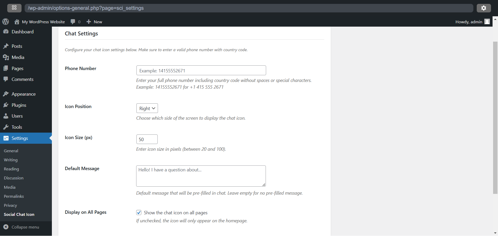

# Social Chat Icon Plugin

A WordPress plugin that adds a customizable WhatsApp chat icon to your website.

## Features
- Easy to configure WhatsApp chat settings
- Customizable icon position (Left/Right)
- Adjustable icon size
- Custom default message
- Option to display on all pages or homepage only

## Screenshots

### Settings Page

## Installation
1. Upload the plugin files to the `/wp-content/plugins/social-chat-icon` directory
2. Activate the plugin through the 'Plugins' menu in WordPress
3. Go to Settings > Social Chat Icon to configure the plugin

## Configuration
1. Enter your WhatsApp phone number (with country code)
2. Choose the icon position (Left or Right)
3. Set the icon size (20-100 pixels)
4. Enter a default message (optional)
5. Choose whether to display the icon on all pages or homepage only
